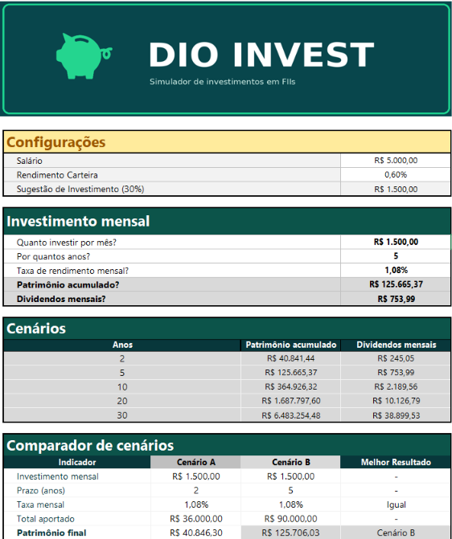
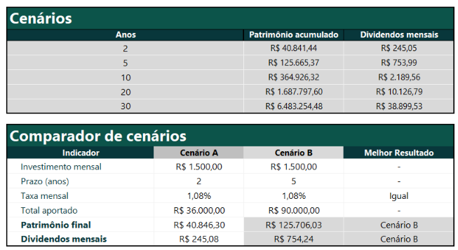
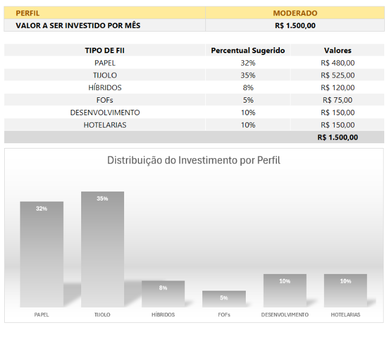

# DIO Invest — Simulador de Investimentos
*Simulador de investimentos desenvolvido em Excel*

## Sobre o projeto

O **DIO Invest** é uma ferramenta desenvolvida no Excel para simular investimentos em Fundos de Investimento Imobiliário (FIIs).

O projeto foi desenvolvido a partir da proposta da DIO e, durante a construção da planilha, **utilizei cálculos de investimento, projeção de patrimônio, dividendos e diferentes perfis de investimento.**

Além da estrutura proposta no desafio, acrescentei algumas funcionalidades para deixar a ferramenta mais completa e facilitar a comparação e a visualização dos resultados.

## Estrutura da planilha

A planilha foi organizada em diferentes etapas para facilitar o preenchimento e a visualização dos resultados:

- **Configurações:** informações utilizadas como base para os cálculos;
- **Investimento mensal:** definição dos valores e período de investimento;
- **Cenários:** projeção do patrimônio e dos dividendos ao longo do tempo;
- **Comparador de Cenários:** comparação entre diferentes possibilidades de investimento;
- **Perfil:** distribuição do investimento de acordo com o perfil escolhido;
- **Base de Dados:** tabela utilizada como apoio para as consultas e cálculos da planilha.

### Visão geral da ferramenta

## Comparador de Cenários

Uma das funcionalidades que acrescentei ao projeto foi o Comparador de Cenários.

Ele permite comparar dois cenários de investimento, podendo alterar o valor do investimento mensal, a taxa de rendimento mensal e o prazo em anos para cada cenário.

Dessa forma, é possível testar diferentes possibilidades e visualizar qual delas apresenta o **melhor resultado**, de acordo com os valores calculados pela planilha.

A ideia foi facilitar a comparação entre diferentes possibilidades de investimento, permitindo analisar os dois cenários lado a lado sem precisar fazer os cálculos separadamente.

### Visualização do Comparador

## Gráfico de distribuição

Também acrescentei um gráfico à última tabela da planilha.

O gráfico **“Distribuição do Investimento por Perfil”** acompanha o perfil selecionado e apresenta visualmente como o investimento é distribuído entre os diferentes tipos de FIIs.

Dessa forma, ao alterar o perfil entre **Conservador, Moderado e Agressivo**, a distribuição apresentada no gráfico também é atualizada.

### Visualização do gráfico

## Recursos utilizados

Durante o desenvolvimento do projeto, utilizei recursos do Excel, como:

- Fórmulas e referências de células;
- Cálculos de porcentagem;
- Fórmulas financeiras;
- Função VF;
- Função PROCV;
- Nomes definidos;
- Tabelas de apoio;
- Comparador de cenários;
- Gráfico de distribuição.
  
## Ferramenta utilizada

**Microsoft Excel**

## Objetivo

O objetivo do projeto é proporcionar uma ferramenta simples e acessível para auxiliar investidores iniciantes a compreenderem como aportes, prazo e rendimento podem influenciar a evolução do patrimônio e dos dividendos ao longo do tempo.
